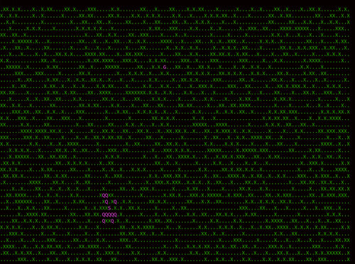

# Shortest Path: Breadth First Search

A directed breadth first search for path finding through a board with constraints.
This problem serves as a refactored solution to this [prompt on codewars.com](https://www.codewars.com/kata/59669eba1b229e32a300001a/train/python).

# Installation and Usage:

To install and run the example:
```
git clone git@github.com:neilSchroeder/tools.git
cd shortest_path_stargate
python3 test_shortest_path.py
```

# Example



# To Do

Tune sorting hyperparameters [here](https://github.com/neilSchroeder/tools/blob/4ff8fbcd37695959baed98c1716c08108d18e7d6/shortest_path_stargate/graph_bfs_class.py#L62)
