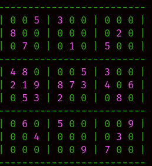

# Sudoku Solver

This is a depth first search algorithm in python which solves sudoku puzzles. This repo serves as a refactored solution to this codewars [prompt](https://www.codewars.com/kata/5588bd9f28dbb06f43000085/train/python).

## Installation and Usage

```
git clone git@github.com:neilSchroeder/tools.git
cd sudoku_solver
python3 test_sudoku.py
```

## Example

A gif of the solution to al escargot:


## Methodology

This software uses a backtracking algorithm. The outline of the algorithm is as follows:

1 Fill as many singletons (cells with only one possible occupant) as possible   
2 When no more singletons exist, find the cell with the fewest possible occupants (2 or more)  
3 Create new boards for all possible occupants of the minimum occupation cell  
4 Attempt to solve each board from 1   

Eventually a solution is found, assuming a solution exists.

## Error Handling

The code will raise an `Exception` if:

- the grid is invalid
- there are multiple solutions
- there are no solutions
